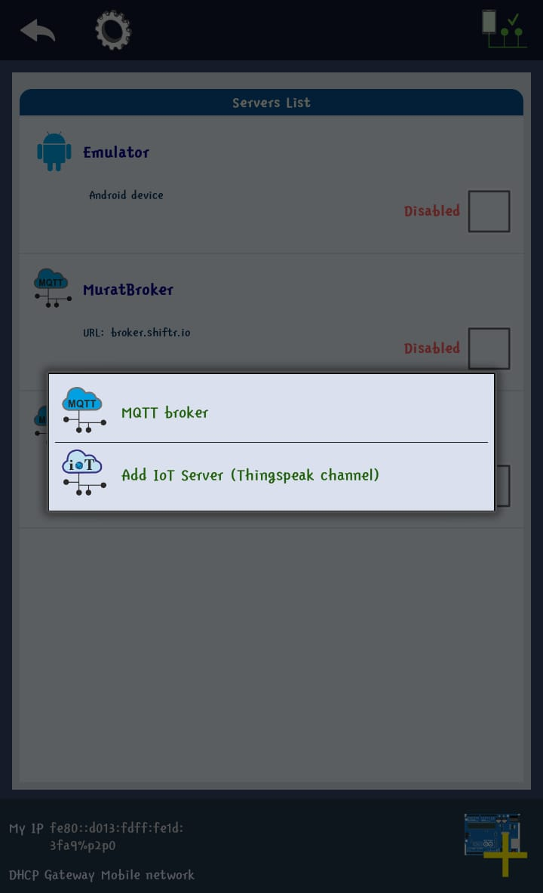
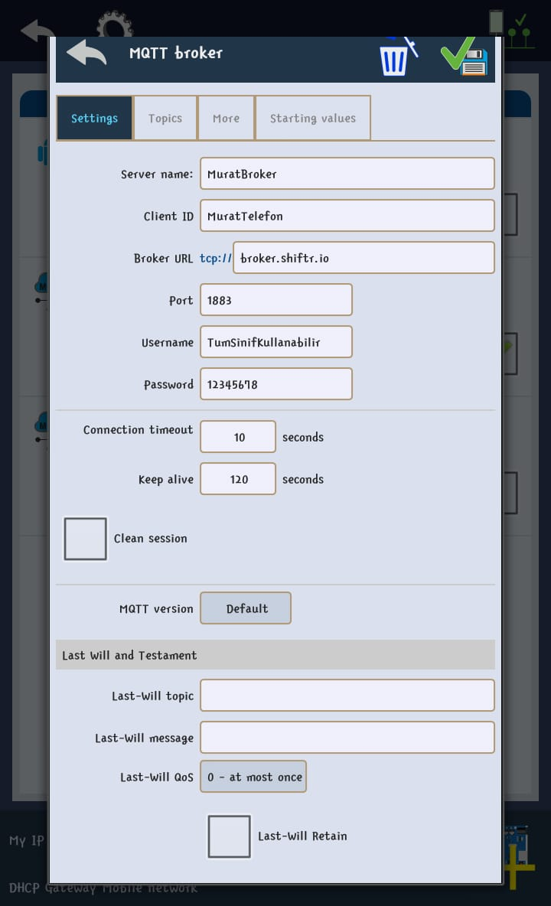
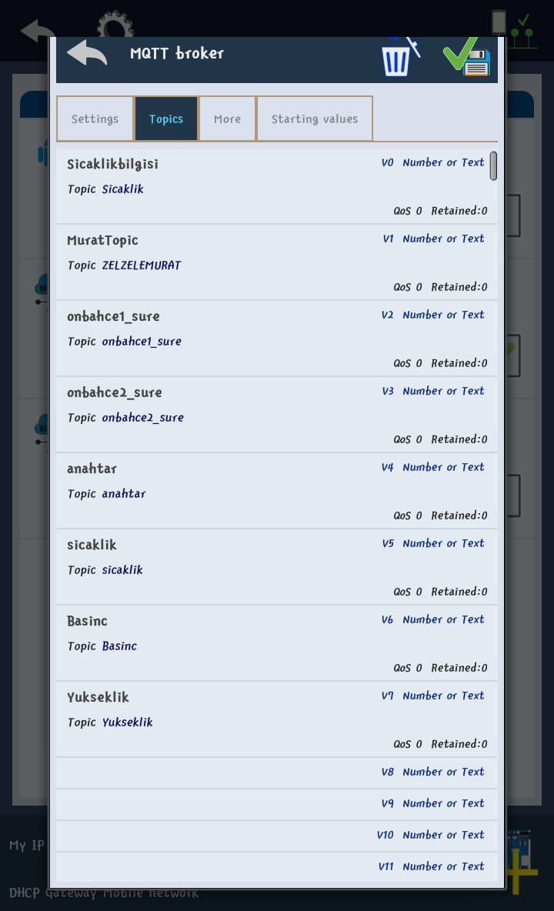

# Data-Transfer-Between-Client
Arduino with client Communication 

Ardunio programınıza bazı kütüphaneleri editörde iken bazı kütüphaneleri eklemeniz gerekmektedir. Bunları sırasıyla
     
     Araçlar -> Kart -> Kart yöneticisi  Gelen kart yöneticisi ekranındam ESP8266 ve MQQT kütüphanelerini ekleyebilirsiniz.

Öncelikle Clientlerden gelen değerleri topicler üzerinde görüntülemek için siteye üyelğinizi açmalısınız.

    https://shiftr.io/

Diğer client olan Mobil uygulamayı indirmeniz gerekmektedir. Android Telefonunuza Virtuino MQTT uygulamasını indirin.

    https://play.google.com/store/apps/details?id=com.virtuino.virtuino_mqtt&gl=TR
    

Mobil uygulamayı açtıktan sonra bazı ayarlamalar yapmamız gerekmektedir.

1) Broker ekliyoruz.

    
    
2) Broker Detaylarını shiftr.io da girdiğiniz ayarlar ile aynı yapınız.

    

3) Son olarak değer göndereceğimiz topicleri ekliyoruz.

    

Uygulamanın anasayfasında bulunan + butonu ile yapacağınız işleme göre seçip, seçtiğiniz tool'a tıklayarak hangi topicden değer alacağını seçmeniz yeterlidir. Son olarak Connect diyerek 2 istemci (Client) arasında bağlantı veri iletişimini sağlayabilirsiniz.

Son olarak Virtuino MQTT dışında Blynk ile de bir çok bu tarz işlemler yapabilirsiniz. Bunlardan biri gelen değerlere göre bildirim gönderme yakınlık, karanlık sensörü kullanımlara olanak sağlamaktadır.
